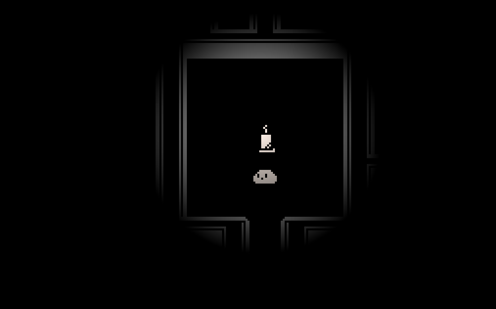
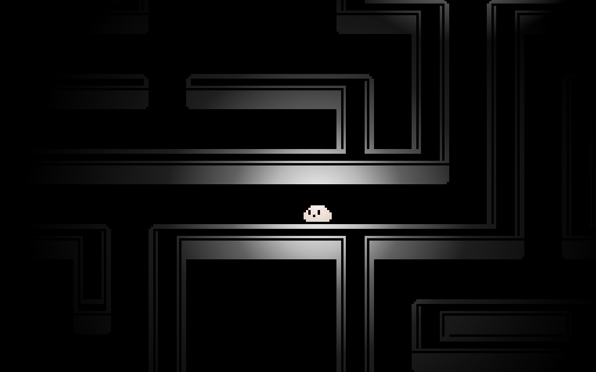
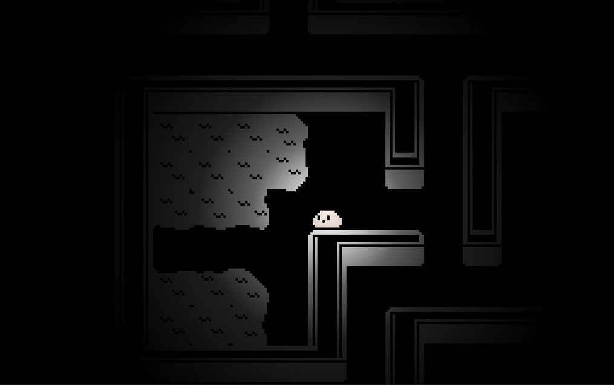

# ANU CSSA Game Jam 2026

## Overview 

Lights Out was made using Godot 4.7.2 and GDScript for the ANU CSSA Game Jam 2026. The theme of the game jam was `LOSING POWER`.

Lights Out is a 2D top-down maze escape game. You play as a slime creature and must escape a dark maze before your torch burns out.

## Controls

Lights Out has a basic control scheme. Use WASD controls to move around the maze.

## Images

  
  
  

## Project structure

- https://youtu.be/V4SO7foDoW4?si=sWQKZhrNbSOF3_D_
- https://youtu.be/5-Ev2ZIQgf4?si=GlAcqbo0Az4DlA7k

## Tips

- https://youtu.be/zLdTvkLsmgA?si=19OJIGoSL4FOnjQd
- https://youtu.be/gVYeNZhROxM?si=lHiNlRXwIUjCxnFU
- https://youtu.be/3EYi3Q8Y_dM?si=v72PXM3uJlqQxaK_

## References
- 2D Grid-based movement: https://www.peanuts-code.com/en/tutorials/gd0010_2d_grid_based_movement/
- Tilemap: https://www.peanuts-code.com/en/tutorials/gd0024_tilemaplayer/
- 2D lighting: https://youtu.be/AAPqEebFV-E?si=taiL4OO5CvJq3gYX
- Fog of war: https://youtu.be/zkMSbQoUd9o?si=XAQUBIPCQUSodRTy

## Assets
- Hexnay's Rougelike Tiles. Licence: CC0 1.0 Universal. Retrieved from: https://hexany-ives.itch.io/hexanys-roguelike-tiles
- Pixel Game Font Family. Free for non-commerical use. Retrieved from: https://www.1001fonts.com/pixel-game-font.html
- Ominous Music. Licence: Attribution NonCommerical 4.0. Retrived from: https://freesound.org/people/Audio_Dread/sounds/524133/